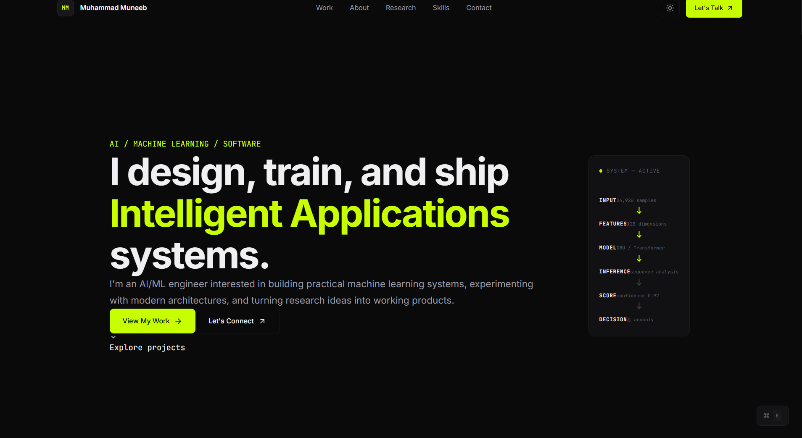

# ⚡ Muneeb Tahir | Developer Portfolio

<div align="center">

[](https://portfolio-jade-seven-t8c37886y3.vercel.app/)

**AI/ML Engineer in Progress | Python Developer**

</div>


<div align="center">

  

  <p>
    <strong>AI/ML Engineer · Software Developer · Problem Solver</strong>
  </p>

  <p>
    A modern portfolio showcasing my journey in software development,
    artificial intelligence, machine learning, and building real-world projects.
  </p>

  <p>
    <a href="https://github.com/Muneeb-Tahir">
      
    </a>
    <a href="https://github.com/Muneeb-Tahir/Portfolio">
      
    </a>
  </p>

  

</div>

## ✨ About This Project

This repository contains my personal developer portfolio — a place to showcase my work, technical interests, projects, and growth as a developer.

Designed with a modern, minimal approach, the portfolio aims to present technical work clearly while maintaining a distinctive visual identity.

### 🎯 Goals

* Showcase selected projects and technical skills.
* Present my background and development journey.
* Highlight my interests in AI, machine learning, and software engineering.
* Provide an easy way to connect and collaborate.
* Build a professional online presence that evolves with my experience.

## 🛠️ Tech Stack

<div align="center">

| Technology   | Purpose                                    |
| ------------ | ------------------------------------------ |
| Next.js      | React framework and application routing    |
| React        | Component-based user interfaces            |
| TypeScript   | Type-safe development                      |
| Tailwind CSS | Utility-first styling                      |
| ESLint       | Code quality and linting                   |
| Bun / npm    | Development tooling and package management |

</div>

<p align="center">
  
</p>

## 🚀 Getting Started

Want to run the portfolio locally? Follow these steps.

### Prerequisites

* Node.js compatible with your installed Next.js version
* Git
* npm or Bun

### Installation

**1. Clone the repository**

```bash
git clone https://github.com/Muneeb-Tahir/Portfolio.git
cd Portfolio
```

**2. Install dependencies**

Using npm:

```bash
npm install
```

Or using Bun:

```bash
bun install
```

**3. Start the development server**

Using npm:

```bash
npm run dev
```

Or using Bun:

```bash
bun dev
```

**4. Open the application**

Visit http://localhost:3000 in your browser.

### Production Build

Run a production build to check that the application compiles successfully.

```bash
npm run build
npm run start
```

To check code quality:

```bash
npm run lint
```

## 📁 Project Structure

```text
Portfolio/
├── public/          # Static assets and public files
├── src/
│   └── app/         # Next.js application routes and UI
├── .gitignore
├── next.config.ts
├── package.json
├── tsconfig.json
└── README.md
```

## 💡 What I'm Working Toward

My focus is on developing practical software and exploring how intelligent systems can solve real-world problems.

* **Artificial Intelligence & Machine Learning** — learning, experimentation, and applied ML.
* **Software Engineering** — building maintainable applications and useful tools.
* **Data-Driven Solutions** — exploring patterns, insights, and intelligent automation.
* **Continuous Learning** — improving through projects, research, and hands-on practice.

## 📊 GitHub Activity

<div align="center">

  

  

</div>

<div align="center">

  

</div>

## 🐍 Contribution Activity

<div align="center">

  

</div>

> **Note:** The contribution animation requires a GitHub Actions workflow in your profile repository. See the setup instructions below.

## 🤝 Let's Connect

I'm always interested in learning, building, and connecting with people who enjoy technology and solving meaningful problems.

<div align="center">

  <a href="https://github.com/Muneeb-Tahir">
    
  </a>

  <!-- Add your LinkedIn profile URL when ready. -->

  <!--
  <a href="YOUR_LINKEDIN_URL">
    
  </a>
  -->

  <!-- Add your professional email when ready. -->

  <!--
  <a href="mailto:YOUR_EMAIL">
    
  </a>
  -->

</div>

---

<div align="center">

  

**Building today. Improving tomorrow.**

<sub>Designed and maintained by Muneeb Tahir.</sub>

</div>
